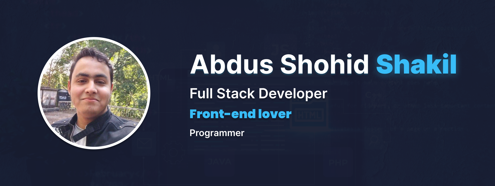

# Abdus Shohid Shakil

**Frontend Focused Fullstack Developer** | CSE Graduate

  
  
  
  
  
  

  
  

## About

- Frontend Focused Fullstack Developer | CSE Graduate
- Complex UI stack: TypeScript, React, Next.js, Tailwind CSS, Shadcn/ui
- SEO Landing Page UI stack: TypeScript, Vue, Nuxt.js, Tailwind CSS, Shadcn/ui
- Backend stack: TypeScript, Node.js, Electron.js, Express, Supabase (Love)
- BD stack: SQLite, MongoDB, MYSQL, Drizzle ORM, Mongoose
- Problem solving: LeetCode + Codeforces

## Tech Stack

  

  
  
  
  
  

## Currently Learning

  

## Featured Projects

- [ApiBolt](https://github.com/developerHub01/ApiBolt)
- [ApiBolt-web](https://github.com/developerHub01/ApiBolt-web)
- [CF Dark (Codeforces theme)](https://github.com/developerHub01/CF_Dark)
- [Scheduler (Chrome Extension)](https://github.com/developerHub01/Schedular-2.o-Chrome-Extension)
- [ShareThought-client (incomplete)](https://github.com/developerHub01/ShareThought-client)
- [ShareThought-server (incomplete)](https://github.com/developerHub01/ShareThought-server)

## GitHub Stats

  

  

  

## Contact

- Email: [shakil102043@gmail.com](mailto:shakil102043@gmail.com)
- Portfolio: [shakil102043.vercel.app](https://shakil102043.vercel.app/)
- LinkedIn: [abdus-shohid-shakil](https://www.linkedin.com/in/abdus-shohid-shakil/)
